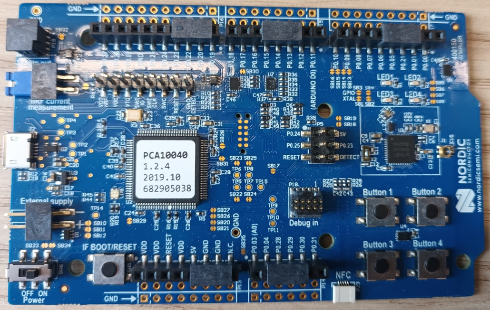

# nRF52832 SoC

This code is tested using the Nordic PCA10040 board. It is a single-board development kit for wireless applications based on the Nordic Semiconductor nRF52832 System-on-Chip (SoC).     

   

The code is based on ZEPHYR Blinky example which toggles an on-board LED.     
